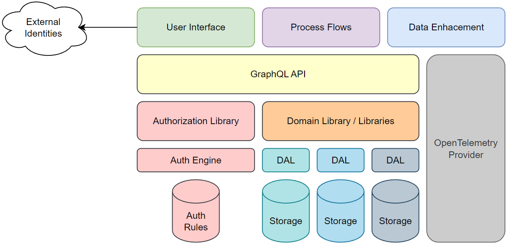

# Supply Chain Analytics and Reporting
This application is a supply chain modeler, reporting engine, and data quality validator.  

All diagrams, concepts, and original work here is copyright Jeremy Yelle, 2023. 
Likeness to the Scar cartoon character are copyright Disney -- I don't claim credit for those.  

PS - It's not a logo it's just for fun :)

This project is broken out into a number of private repositories:

* [scar-services](..) - Provides the domain services necessary to interface with the backend
* [scar-ui](..) - Provides the user interface launchpoint for the main app
* [scar-packages](..) - Provides a repository for the workflow nodes 
* [scar-workflows](..) - A repository for the workflow engine itself
* [scar-questionnaire](..) - A third-party questionnaire tool for data enhancement

Initial thoughts on tech stack:
* Node-RED for process flow builder
* Github Packages / Verdaccio for node functionality
* Remix Labs (?still pre-launch) for Questionnare / Data Enhancement
* Node/React UI
* NodeJS / Koa for UI Stack
* C# for backend domain layers (because it's multithreaded)